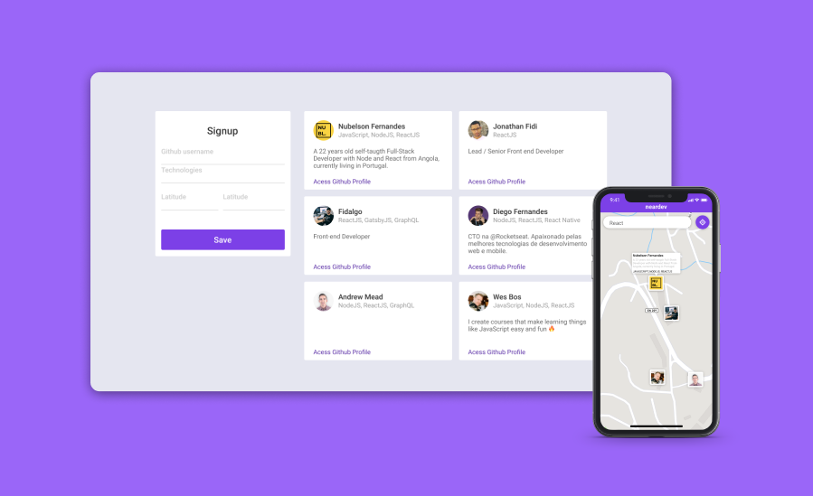

# Neardev (Frontend w/ React.js)

Mobile version [here](https://github.com/nubelsondev/Neardev-Mobile).




This is Neardev's web frontend, an application that allows developers to register using the github username, technologies of interest and location (actual location obtained by the browser) and lists all users registered in the application.

## Getting Started

These instructions will get you a copy of the project up and running on your local machine for development and testing purposes. Feel free to deploy if you want.

### Prerequisites

You will need the [backend](https://github.com/nubelsondev/neardev-backend) to be running so that you can connect both sides of the Application.

```javascript
/*
Default Backend URL
$ http://localhost:3333
*/
```

### Installation

Clone the repository and run

```javascript
// With NPM
$ npm install
$ npm run start

// With Yarn
$ yarn install
$ yarn start
```

## Built With

-   [ReactJS](https://reactjs.org/)
-   [Sass](https://sass-lang.com/)
-   [Axios](https://github.com/axios/axios)
-   [Formik](https://jaredpalmer.com/formik/)

## Contributing

Please feel free to send pull request if you want to contribute!

## Authors

-Nubelson - _Development_ - [nubelsondev](https://github.com/nubelsondev)
